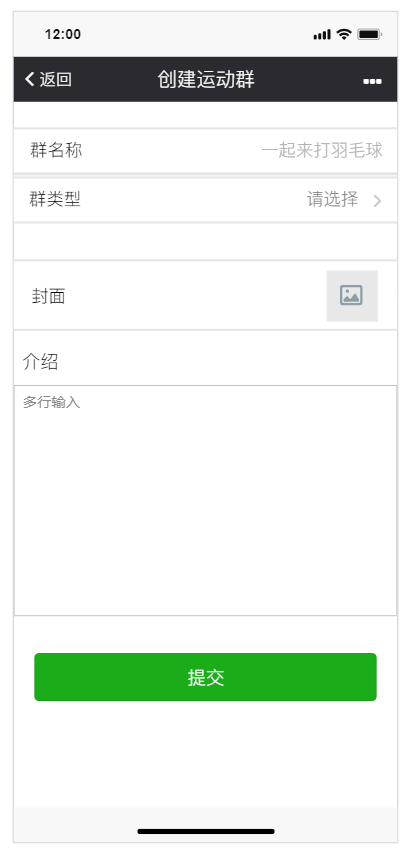

# 建立运动群与发布活动报名

要发起一个活动之前必须要先建立一个运动群，然后才能到运动群里面发起一次活动。只要是系统的会员都能进行建立运动群并发起活动，然后进行活动组织。

## 群类型说明

群类型 | 说明描述
----- | -----  
私有群 | 不可能被搜索到，并且不能展示到广场
公开群 | 可能被搜索到，并且能展示到广场

## 建群流程与规则

    进入建群页面=》输入字段并提及审核=》审核通过=》群可以被发现并进行发布活动
    审核功能可以进行开关配置
    1. 私有群不需要审核。
    2. 所有类型都需要进行审核。
    3. 所有类型都不需要进行审核

### 创建群字段

字段名称 | 可选项 | 规则
----- | -----  | -----
群名称 | 无     | 不能为空，最多20个字符
类型   | 私有群、公开群 |
封面   | 无     | 为空的时候，系统默认选择一个封面来显示，大小不能超过300K,超过客户端进行压缩，格式为jpeg,jpg,png等常见图片格式
介绍   | 无     |

填入符合规则的内容，点击提交即成功创建运动群，如果为公有群则需要等待审核，审核通过后，群则成为有效群，如果创建的是为私有群则创建成功时立刻成为有效群。`只有成为有效群才能进行一系列活动`

## 发布运动报名贴

在运动群生效后就可以在群里进行发布打球运动报名贴，发完贴后可以分享报名贴给其他人邀请他人来报名活动。

    一个活动的周期
    创建=》报名阶段=》活动阶段=》费用公示

### 报名贴字段

字段名称 | 可选项 | 规则
----- | -----  | -----
活动开始时间 | 日历选项     | 不能早于现在的时间
活动结束时间 | 日历选项     | 不能早于现在的时间，并且不能早于活动开始时间
报名截止时间   | 日历选项 | 不能早于现在的时间，并且不能晚于活动开始时间
人数   | 无     | 不能小于1
地点   | 无     |
费用类型   | AA,人均固定    |
人均固定费用   | 无    |
飞机费用   | AA,固定费用     |
描述   | 无     |
